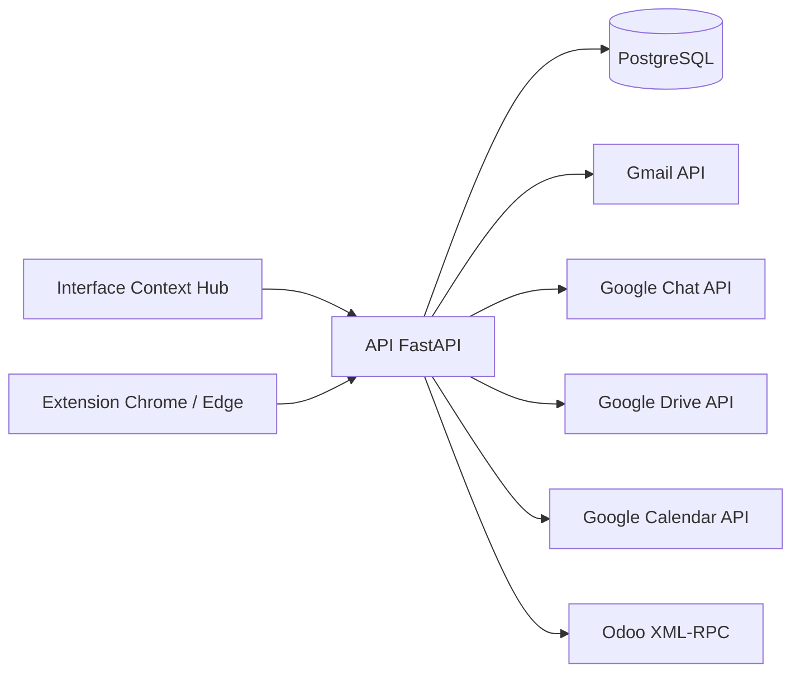

# Architecture du Context Hub

## Principe

Le Hub est un client transversal et un index de contexte. La ressource canonique reste dans Gmail, Google Chat, Google Drive, Google Calendar ou Odoo ; Context Hub utilise les API officielles pour l’afficher et la modifier, puis ne conserve dans un contexte qu’une référence stable et des métadonnées légères.

L’interface web reconstruit des expériences adaptées à chaque source : liste, recherche, détail, création, modification, suppression et rattachement. Elle ne charge aucune application tierce dans une `iframe`, ne diffuse aucun navigateur distant et ne redirige pas l’utilisateur.

## Modèle logique

### Contexte

- identifiant UUID indépendant des outils sources ;
- titre et description ;
- champs historiques de catégorisation conservés uniquement pour compatibilité API et non exposés dans l’interface ;
- dates de création et de mise à jour.

### Référence de ressource

- `source` : `gmail`, `chat`, `drive`, `calendar` ou `odoo` ;
- `external_id` : identifiant stable de la source ;
- `url` : lien interne persistant vers la vue Context Hub ;
- `title`, `resource_type`, `excerpt`, `author_name`, `occurred_at` ;
- `extra` : métadonnées spécifiques non structurantes.

La contrainte unique `(context_id, source, external_id)` empêche un doublon dans un même contexte. Une ressource peut être rattachée à plusieurs contextes.

### Connecteur

- fournisseur et état de connexion ;
- configuration et identifiants chiffrés avec Fernet ;
- compte externe, erreur éventuelle et date de synchronisation ;
- état de mise à niveau des scopes OAuth.

Les valeurs sensibles ne sont jamais sérialisées vers le navigateur après leur enregistrement.

## Composants

| Composant | Responsabilité | Technologie |
|---|---|---|
| Interface web | Vues sources, CRUD, contextes et paramètres | HTML/CSS/JavaScript natif |
| API | OAuth, XML-RPC, normalisation et contrats REST | FastAPI |
| Extension | Panneau latéral et rattachement depuis un navigateur normal | Chrome Manifest V3 |
| Persistance | Contextes, références et connecteurs chiffrés | PostgreSQL 16 |
| Connecteur Google | Lecture et écriture des ressources | OAuth 2.0 + API Google Workspace |
| Connecteur Odoo | Lecture et écriture des objets métier | XML-RPC |
| Entrée VPS | TLS et proxy inverse | Caddy |

## Comportement par source

- **Gmail** : liste de conversations, détail de chaque message, envoi, libellés usuels, archivage et corbeille. Le rattachement distingue conversation entière et message individuel.
- **Google Chat** : liste des espaces comme navigation uniquement, puis lecture, création, modification, suppression et rattachement des messages. Un espace n’est jamais une ressource attachable.
- **Google Drive** : fichiers de Mon Drive, éléments `sharedWithMe` et éléments de Drive partagés via `includeItemsFromAllDrives` et `supportsAllDrives`; création de dossiers et fichiers Google natifs, métadonnées et corbeille.
- **Google Calendar** : liste, détail, création, modification, suppression et rattachement d’événements.
- **Odoo** : recherche et CRUD des opportunités, contacts, projets et tâches selon les ACL du compte API.

Les capacités effectives restent limitées par les droits du compte source. Par exemple, Chat n’autorise la modification ou la suppression que lorsque l’API et l’auteur du message le permettent ; Drive expose des `capabilities` par fichier.

## Flux de rattachement

1. L’utilisateur recherche ou ouvre une ressource dans une vue interne.
2. Le Hub charge son détail depuis l’API source.
3. Gmail propose le fil complet ou un message ; Chat propose uniquement un message.
4. L’utilisateur sélectionne un contexte existant ou en crée un.
5. Le Hub mémorise uniquement la référence et les métadonnées.

## Flux de connexion

### Google

1. L’administrateur enregistre le Client ID et le Client secret.
2. Le serveur les chiffre en base.
3. Le consentement OAuth demande les scopes Gmail, Chat, Drive et Calendar nécessaires.
4. Le callback chiffre les jetons et identifie le compte.
5. Chaque vue utilise le jeton d’accès et le renouvelle avec le refresh token.

Une modification des scopes rend visible une action de réautorisation dans Paramètres.

### Odoo

1. L’utilisateur fournit URL, base, identifiant et clé API.
2. Le serveur authentifie l’utilisateur via XML-RPC.
3. La configuration et l’UID sont chiffrés.
4. Les vues exécutent `search_read`, `read`, `create`, `write` et `unlink` selon les droits Odoo.

## Déploiement

La pile contient uniquement l’application et PostgreSQL en local. La surcharge de production ajoute Caddy. Les données du Hub se trouvent dans le volume `context_hub_data`. La clé `APP_SECRET_KEY` doit rester stable lors d’une migration.

## Limites et trajectoire

1. Ajouter SSO OIDC, rôles et visibilité par contexte avant production.
2. Distribuer l’extension de façon privée et administrée.
3. Finaliser la validation Google des scopes sensibles ou restreints.
4. Ajouter pagination, chargement incrémental et pièces jointes riches.
5. Remplacer `create_all` par Alembic.
6. Ajouter audit immuable, métriques et sauvegardes restaurées en test.
