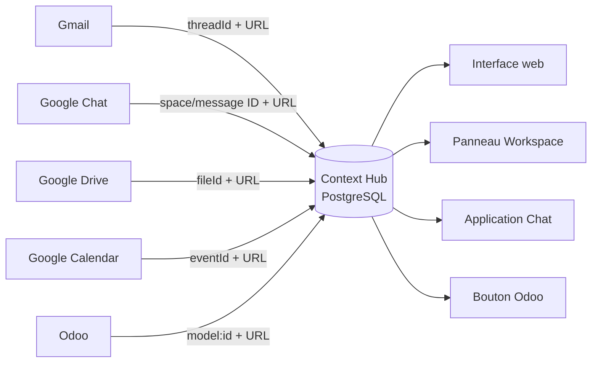

# Architecture du Context Hub

## Principe

Le Hub est un **index de contexte**, pas un nouvel entrepôt documentaire. La ressource canonique reste dans son application source. Le Hub stocke un lien profond et une clé stable, puis enrichit cette référence avec des métadonnées légères qui facilitent la recherche et l’affichage.

## Modèle logique

### Contexte

- identifiant UUID indépendant des outils sources ;
- titre, résumé, type métier, statut et priorité ;
- responsable, échéance, couleur et étiquettes ;
- historique minimal des rattachements et modifications.

### Référence de ressource

- `source` : `gmail`, `chat`, `drive`, `calendar` ou `odoo` ;
- `external_id` : identifiant stable fourni par la source ;
- `url` : lien profond vers l’élément canonique ;
- `title`, `resource_type`, `excerpt`, `author_name`, `occurred_at` ;
- `extra` : métadonnées spécifiques non structurantes.

La contrainte unique `(context_id, source, external_id)` empêche de rattacher deux fois la même ressource au même contexte. Une même ressource peut volontairement appartenir à plusieurs contextes.

## Composants

| Composant | Responsabilité | Technologie |
|---|---|---|
| Application | REST, règles de rattachement, cartes d’intégration, interface | FastAPI + JavaScript natif |
| Persistance | Contextes, références et activité | PostgreSQL 16 |
| Runtime Workspace | Cartes Gmail/Drive/Calendar et actions | Endpoints HTTP JSON |
| Chat | Recherche conversationnelle simple | Google Chat interaction events |
| Odoo | Résolution par `model:id` et navigation | Module Odoo + REST/HMAC |
| Entrée VPS | TLS, compression, en-têtes de sécurité | Caddy |

Le frontend sans compilation réduit le nombre de conteneurs, le temps de démarrage et la surface de maintenance. L’API reste découplée : une future interface React, mobile ou un autre add-on peut consommer les mêmes contrats.

## Flux de rattachement

1. Un utilisateur ouvre une ressource dans Gmail, Drive, Calendar ou Odoo.
2. L’intégration envoie au Hub l’identifiant stable et le type de source.
3. Le Hub recherche la référence.
4. Si elle existe, il ouvre ou affiche le contexte associé.
5. Sinon, l’utilisateur choisit ou crée un contexte, puis le Hub mémorise la référence.
6. À l’ouverture, l’URL profonde ramène l’utilisateur vers la donnée canonique et les droits du système source continuent de s’appliquer.

## Limites du MVP et trajectoire

Les bases fonctionnelles et les contrats sont présents, mais une mise en production d’entreprise doit compléter les points suivants :

1. **Identité et autorisations** : SSO OIDC, rôles, visibilité par contexte et filtrage des références selon l’utilisateur.
2. **Validation Google** : vérification cryptographique des jetons système/utilisateur, consentement OAuth et publication interne du module complémentaire.
3. **Métadonnées riches** : appels ponctuels aux API sources avec les jetons utilisateur, sans persistance du contenu, pour récupérer les titres exacts.
4. **Automatisation** : suggestions de contexte fondées sur participants, domaine, identifiants client et similarité sémantique, toujours confirmées par l’utilisateur.
5. **Exploitation** : migrations Alembic, métriques, traces, journal d’audit immuable, rétention et procédures de restauration testées.
6. **Odoo multi-version** : modules séparés ou matrice de test pour les versions 17, 18 et suivantes.
