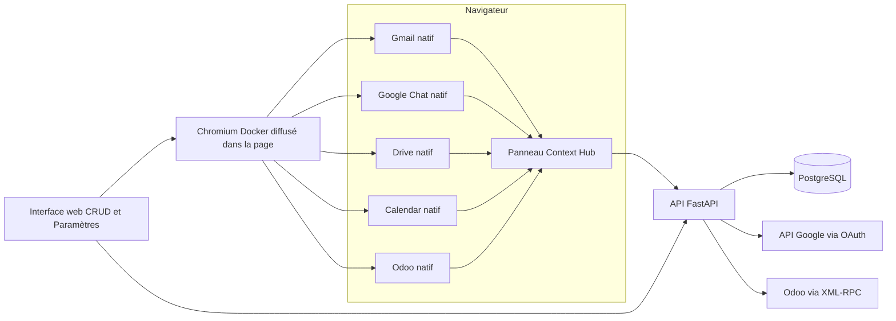

# Architecture du Context Hub

## Principe

Le Hub est un **index de contexte**, pas un entrepôt documentaire ni une copie des applications sources. La ressource canonique reste dans Gmail, Chat, Drive, Calendar ou Odoo. Context Hub stocke un lien profond, une clé stable et des métadonnées légères.

Deux surfaces complémentaires conservent l’interface native de chaque outil :

- un Chromium distant conteneurisé est rendu dans le Hub pour l’expérience intégrée demandée ;
- l’extension Chrome/Edge transforme un onglet local en espace de travail avec panneau persistant.

Une application web classique ne peut pas charger directement les applications Google dans des `iframe` : elles imposent des protections d’encadrement. Le mode intégré contourne cette limite sans modifier leurs réponses HTTP en diffusant les pixels d’un véritable Chromium distant. Le mode extension conserve quant à lui la session et le rendu locaux.

## Modèle logique

### Contexte

- identifiant UUID indépendant des outils sources ;
- titre et description ;
- champs historiques de catégorisation conservés uniquement pour compatibilité API et non exposés dans l’interface ;
- dates de création et de mise à jour.

### Référence de ressource

- `source` : `gmail`, `chat`, `drive`, `calendar` ou `odoo` ;
- `external_id` : identifiant stable fourni ou dérivé de la source ;
- `url` : lien profond vers l’élément canonique ;
- `title`, `resource_type`, `excerpt`, `author_name`, `occurred_at` ;
- `extra` : métadonnées spécifiques non structurantes.

La contrainte unique `(context_id, source, external_id)` empêche un doublon dans un même contexte. Une ressource peut volontairement être rattachée à plusieurs contextes.

### Connecteur

- fournisseur et état de connexion ;
- configuration et identifiants chiffrés avec Fernet ;
- compte externe, erreur éventuelle et date de synchronisation ;
- statistiques légères de contrôle.

Les valeurs sensibles ne sont jamais sérialisées vers le navigateur après leur enregistrement.

## Composants

| Composant | Responsabilité | Technologie |
|---|---|---|
| Interface web | CRUD, recherche, références et paramètres | HTML/CSS/JavaScript natif |
| API | Règles métier, OAuth, XML-RPC et contrats REST | FastAPI |
| Extension | Panneau latéral, détection de l’URL et rattachement | Chrome Manifest V3 |
| Navigateur intégré | Interfaces complètes diffusées dans le Hub, profil persistant | Chromium + Selkies |
| Persistance | Contextes, références et connecteurs chiffrés | PostgreSQL 16 |
| Connecteur Google | Consentement et lectures ponctuelles | OAuth 2.0 + API Google |
| Connecteur Odoo | Validation et compteurs métier | XML-RPC |
| Entrée VPS | TLS et proxy inverse | Caddy |

Le frontend sans compilation réduit le nombre de conteneurs et la surface de maintenance. L’API reste indépendante de l’extension : les add-ons Workspace, Google Chat et le module Odoo existants peuvent continuer à consommer les mêmes données.

## Flux de rattachement

1. L’utilisateur ouvre une ressource dans son application native.
2. Le script de contenu extrait la source, l’URL et l’identifiant disponible.
3. Le panneau recherche un contexte via l’API ou en crée un nouveau.
4. L’utilisateur confirme le rattachement ; après une création, celui-ci est automatique.
5. Le Hub mémorise uniquement la référence et les métadonnées.
6. À l’ouverture, le lien profond renvoie vers l’outil source, qui continue d’appliquer ses propres droits.

## Flux de connexion

### Google

1. L’administrateur enregistre le Client ID et le Client secret.
2. Le serveur les chiffre en base.
3. Le navigateur ouvre le consentement OAuth avec un `state` aléatoire valable quinze minutes.
4. Le callback échange le code, chiffre les jetons et identifie le compte.
5. Une synchronisation utilise le jeton d’accès ou le renouvelle grâce au refresh token.

### Odoo

1. L’utilisateur fournit URL, base, identifiant et clé API.
2. Le serveur teste la version et authentifie l’utilisateur via XML-RPC.
3. La configuration et l’UID sont chiffrés.
4. Les synchronisations effectuent des `search_count` sans recopier les fiches.

## Déploiement

La pile locale contient l’application, PostgreSQL, Chromium et un relais CDP strictement interne permettant à l’API d’identifier l’onglet affiché. La surcharge de production ajoute Caddy. Les données se trouvent dans deux volumes : `context_hub_data` pour le Hub et `context_browser_data` pour le profil du navigateur. La clé `APP_SECRET_KEY` doit être sauvegardée avec la configuration et rester stable lors d’une migration.

## Limites et trajectoire

1. **Identité du Hub** : ajouter SSO OIDC, rôles et visibilité par contexte avant production.
2. **Publication de l’extension** : distribution privée gérée par l’organisation plutôt que mode développeur.
3. **Validation Google** : consentement interne ou procédure de vérification pour les scopes sensibles.
4. **Détection DOM** : les URL sont plus stables que le DOM des applications ; maintenir des tests par source quand leurs interfaces évoluent.
5. **Migrations** : remplacer `create_all` par Alembic pour les évolutions de schéma.
6. **Exploitation** : ajouter audit immuable, métriques, sauvegardes restaurées en test et rotation contrôlée des secrets.
